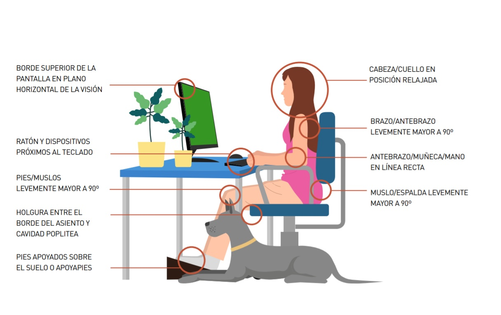

```txt
  _    _       _     _ _               _____       _           _       _     _
 | |  | |  // | |   (_) |             / ____|     | |         | |     | |   | |
 | |__| | __ _| |__  _| |_ ___  ___  | (___   __ _| |_   _  __| | __ _| |__ | | ___  ___
 |  __  |/ _` | '_ \| | __/ _ \/ __|  \___ \ / _` | | | | |/ _` |/ _` | '_ \| |/ _ \/ __|
 | |  | | (_| | |_) | | || (_) \__ \  ____) | (_| | | |_| | (_| | (_| | |_) | |  __/\__ \
 |_|  |_|\__,_|_.__/|_|\__\___/|___/ |_____/ \__,_|_|\__,_|\__,_|\__,_|_.__/|_|\___||___/

```

[⬅️ Volver al README](../../README.md)

> El buen código nace de buenas prácticas técnicas, pero se sostiene en el tiempo gracias al cuidado de quien lo escribe.

> Estas recomendaciones apuntan a tu salud, tu foco y tu motivación como desarrollador/a.

## CUIDADO DE LA VISTA 👀

- Realiza pausas visuales cada cierto tiempo
  - → Mira un punto lejano durante unos segundos para relajar los músculos oculares
- Usá lentes con filtro de luz azul
  - → o activa el modo nocturno / night light en tu sistema
- Si trabajas de noche:
  - Evita la oscuridad total, usa una iluminación ambiental suave

## POSTURA CORPORAL 👍

🧍Tu cuerpo también es una herramienta de trabajo. Cuidarlo es parte del oficio.

- Manten una postura erguida pero relajada
  - espalda recta
  - pies completamente apoyados en el piso
- Codos a la altura del teclado
  - antebrazos y manos alineados, paralelos al suelo
- Muñecas en posición natural
  - Evita doblarlas o forzarlas
- Siempre que puedas, usa una silla ergonómica

[](Cronograma)

## DIETA SANA 🍎

- Respeta los habitos de comida, desayuno, almuerzo, merienda y cena
  - Toma un tiempo exclusivo para esos momentos
  - Fuera de la oficina!!!
- Beber abundante agua durante el día
- Modera el consumo de cafeína

## OTROS HÁBITOS Y EJERCICIOS SALUDABLES 😄

- Evitar posturas forzadas o tensionadas
- Evitar mantener demasiado tiempo la misma postura o rutina
- Utilizar la mínima fuerza para pulsar las teclas
- Es mejor tomar muchas pausas cortas en lugar de pocas y prolongadas
- Realizar algún ejercicio para mejorar la circulación mientras trabajamos
  - Flexionar los pies, mover las manos, estirar cuello y espalda, etc

## DISFRUTA DE LO QUE HACES!!! NOS ENCANTA PROGRAMAR!!! 🖥️

- Programar es resolver problemas, crear soluciones y aprender todos los días.
- 🔥 Cuidarte te permite rendir mejor, aprender más y disfrutar el proceso.
- 💙 Nos encanta programar, y queremos seguir haciéndolo por mucho tiempo.

<hr/>

---

[⬅️ Volver al README](../../README.md)
