# Lenguaje Markdown para archivos `.md`

[⬅️ Volver al README](../../README.md)

---

## 📝 Tomar apuntes digitales

Una herramienta muy útil para trabajar con Markdown es **Obsidian**.

- [Obsidian — Página oficial](https://obsidian.md/)
- [Obsidian — Primeros pasos](https://www.youtube.com/watch?v=64pI_dKYZOg)

---

# 📚 Guía rápida de Markdown

Markdown es un lenguaje de marcado ligero utilizado para crear documentos con formato utilizando texto plano.

Es muy utilizado para:

- README de proyectos.
- Documentación.
- Apuntes.
- Wikis.
- Documentación técnica.
- Issues y Pull Requests.
- Blogs.
- Notas personales.

La extensión habitual de estos archivos es:

```text
.md
```

---

# 1. Títulos

Los títulos se crean utilizando `#`.

```md
# Título 1

## Título 2

### Título 3

#### Título 4

##### Título 5

###### Título 6
```

Resultado:

# Título 1

## Título 2

### Título 3

#### Título 4

##### Título 5

###### Título 6

> Se recomienda utilizar los títulos de forma jerárquica.  
> Por ejemplo: `#` para el título principal, `##` para secciones y `###` para subsecciones.

---

# 2. Texto

## Negrita

```md
**Texto en negrita**
```

Resultado:

**Texto en negrita**

También puede utilizarse:

```md
**Texto en negrita**
```

---

## Cursiva

```md
_Texto en cursiva_
```

Resultado:

_Texto en cursiva_

También:

```md
_Texto en cursiva_
```

---

## Negrita + cursiva

```md
**_Texto en negrita y cursiva_**
```

Resultado:

**_Texto en negrita y cursiva_**

---

## Texto tachado

```md
~~Texto tachado~~
```

Resultado:

~~Texto tachado~~

---

# 3. Saltos de línea y párrafos

Para crear un nuevo párrafo se deja una línea vacía:

```md
Este es el primer párrafo.

Este es el segundo párrafo.
```

Para realizar un salto de línea dentro del mismo párrafo se pueden utilizar dos espacios al final de la línea:

```md
Primera línea.  
Segunda línea.
```

Resultado:

Primera línea.  
Segunda línea.

---

# 4. Listas

## Lista desordenada

Se pueden utilizar `-`, `*` o `+`.

```md
- HTML
- CSS
- JavaScript
- TypeScript
```

Resultado:

- HTML
- CSS
- JavaScript
- TypeScript

---

## Lista ordenada

```md
1. Instalar Node.js
2. Crear el proyecto
3. Instalar dependencias
4. Ejecutar la aplicación
```

Resultado:

1. Instalar Node.js
2. Crear el proyecto
3. Instalar dependencias
4. Ejecutar la aplicación

---

## Listas anidadas

```md
- Frontend
  - React
  - TypeScript
  - Tailwind
- Backend
  - Node.js
  - NestJS
- Base de datos
  - PostgreSQL
```

Resultado:

- Frontend
  - React
  - TypeScript
  - Tailwind
- Backend
  - Node.js
  - NestJS
- Base de datos
  - PostgreSQL

---

# 5. Checklist

Los checkboxes son muy útiles para documentar tareas.

```md
- [x] Crear proyecto
- [x] Instalar dependencias
- [ ] Crear componentes
- [ ] Crear tests
- [ ] Realizar deploy
```

Resultado:

- [x] Crear proyecto
- [x] Instalar dependencias
- [ ] Crear componentes
- [ ] Crear tests
- [ ] Realizar deploy

---

# 6. Enlaces

La sintaxis básica es:

```md
[Texto del enlace](https://www.ejemplo.com)
```

Ejemplo:

```md
[GitHub](https://github.com/)
```

Resultado:

[GitHub](https://github.com/)

---

## Enlaces a archivos del proyecto

También podemos enlazar otros archivos:

```md
[Ver documentación](./docs/documentacion.md)
```

O volver al README:

```md
[⬅️ Volver](../../README.md)
```

---

# 7. Imágenes

La sintaxis es:

```md

```

Ejemplo:

```md

```

El texto alternativo permite describir la imagen y mejora la accesibilidad.

---

## Cambiar tamaño y posición

Markdown estándar no permite controlar directamente el tamaño de una imagen.

Cuando el visor permite HTML, podemos utilizar:

```html
<p align="center">
  
</p>
```

Esto permite:

- Centrar la imagen.
- Establecer un ancho del 80%.
- Agregar texto alternativo.

---

# 8. Separadores

Podemos crear una línea horizontal utilizando:

```md
---
```

También:

```md
---
```

Resultado:

---

# 9. Citas

Para crear una cita se utiliza `>`.

```md
> Esta es una cita.
```

Resultado:

> Esta es una cita.

También podemos utilizar citas de varias líneas:

```md
> Markdown es un lenguaje de marcado ligero.
>
> Es muy utilizado para documentación.
```

---

# 10. Código

Una de las características más importantes de Markdown para documentación técnica es la posibilidad de mostrar código.

## Código en línea

Para código corto utilizamos una sola tilde invertida:

```md
Utilizamos `console.log()` para mostrar información en JavaScript.
```

Resultado:

Utilizamos `console.log()` para mostrar información en JavaScript.

---

## Bloques de código

Para bloques de código utilizamos tres backticks:

````md
```js
const nombre = "Ariel";

console.log(nombre);
```
````

# 11. Diagramas de flujo con Mermaid

Markdown puede utilizarse junto con **Mermaid** para crear diagramas directamente dentro de los archivos `.md`.

Mermaid permite representar visualmente:

- Diagramas de flujo.
- Procesos.
- Decisiones.
- Arquitecturas.
- Relaciones entre componentes.
- Diagramas de secuencia.
- Estados.

Es especialmente útil para documentar proyectos de software.

> GitHub y Obsidian soportan Mermaid.

---

## 11.1. Diagrama de flujo básico

Para crear un diagrama utilizamos un bloque de código indicando `mermaid`.

### Código

```.md
flowchart TD
    A[Inicio] --> B[Ingresar datos]
    B --> C[Procesar datos]
    C --> D[Mostrar resultado]
    D --> E[Fin]
```

### Resultado

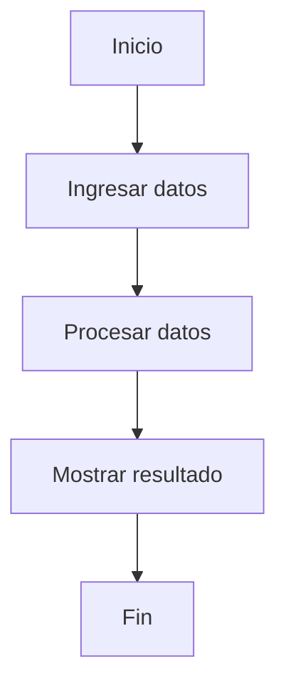

### Conceptos

- `flowchart` indica que estamos creando un diagrama de flujo.
- `TD` indica que el flujo va de arriba hacia abajo.
- `[Texto]` representa un proceso.
- `-->` representa una conexión entre elementos.

---

## 11.2. Dirección del flujo

`flowchart TD` indica que el flujo va de **arriba hacia abajo**.

También podemos utilizar diferentes direcciones:

| Código | Dirección           |
| ------ | ------------------- |
| `TD`   | Arriba → abajo      |
| `TB`   | Arriba → abajo      |
| `LR`   | Izquierda → derecha |
| `RL`   | Derecha → izquierda |

### Ejemplo vertical

#### Código

```.md
flowchart TD
    A[Inicio] --> B[Proceso]
    B --> C[Fin]
```

#### Resultado

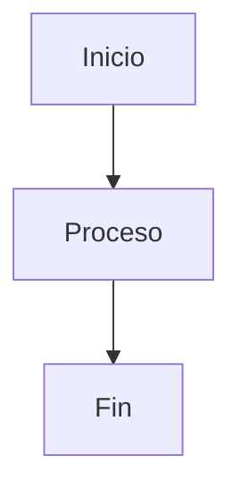

### Ejemplo horizontal

#### Código

```.md
flowchart LR
    A[Inicio] --> B[Proceso]
    B --> C[Fin]
```

#### Resultado

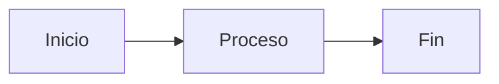

---

## 11.3. Procesos

Los procesos o acciones se representan normalmente utilizando `[ ]`.

### Ejemplo

#### Código

```.md
flowchart TD
    A[Ingresar usuario] --> B[Validar datos]
    B --> C[Guardar información]
    C --> D[Mostrar resultado]
```

#### Resultado

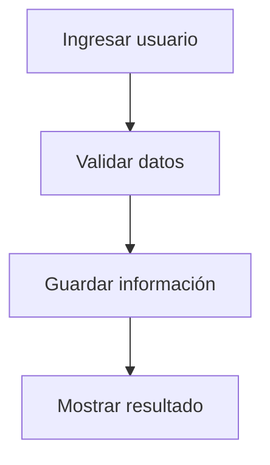

En este ejemplo:

- `A`, `B`, `C` y `D` son identificadores internos.
- `[Texto]` es el texto que se muestra en el diagrama.
- `-->` conecta los diferentes pasos.

---

## 11.4. Decisiones

Las decisiones se representan utilizando `{ }`.

### Ejemplo

#### Código

```.md
flowchart TD
    A[Inicio] --> B[Ingresar usuario]
    B --> C{¿Credenciales válidas?}

    C -->|Sí| D[Ingresar al sistema]
    C -->|No| E[Mostrar error]

    E --> B
    D --> F[Fin]
```

#### Resultado

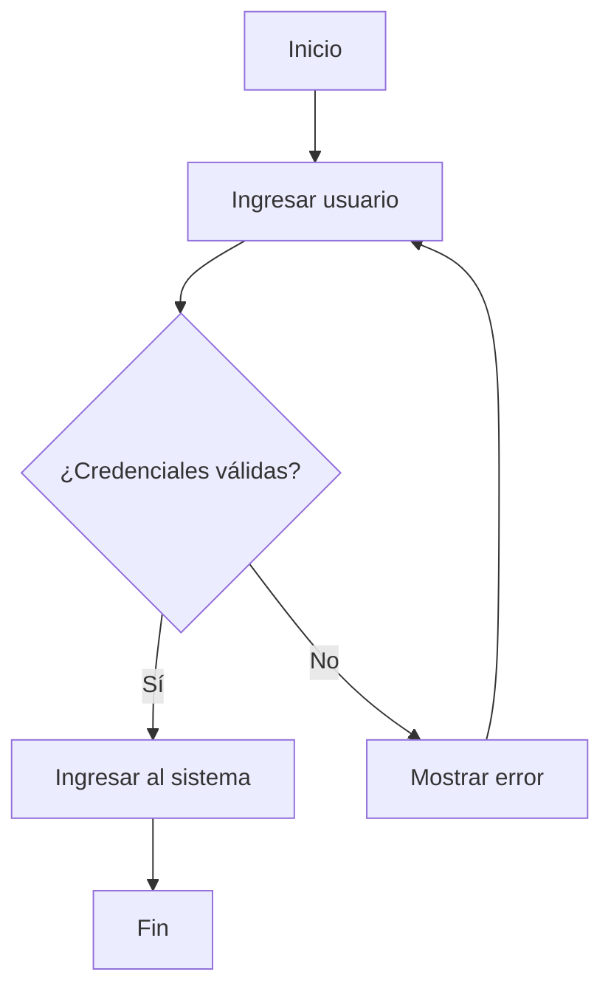

En este ejemplo:

- `[ ]` representa una acción.
- `{ }` representa una decisión.
- `-->` representa una conexión.
- `|Sí|` y `|No|` representan las posibles respuestas.

---

## 11.5. Flujo con varias decisiones

Podemos encadenar varias decisiones.

### Código

```.md
flowchart TD
    A[Inicio] --> B{¿Usuario autenticado?}

    B -->|No| C[Mostrar Login]
    B -->|Sí| D{¿Es administrador?}

    D -->|Sí| E[Mostrar Panel Admin]
    D -->|No| F[Mostrar aplicación]

    C --> G[Ingresar credenciales]
    G --> B
```

### Resultado

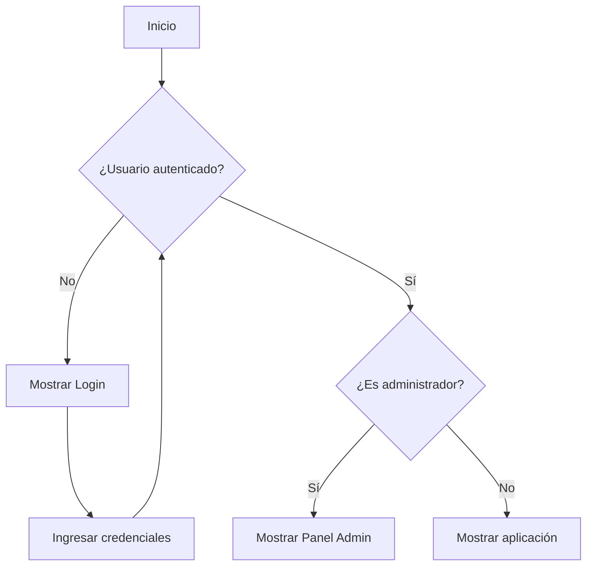

Este tipo de diagrama es muy útil para representar:

- Autenticación.
- Autorización.
- Validaciones.
- Permisos.
- Diferentes caminos dentro de una aplicación.

---

## 11.6. Ejemplo aplicado a un e-commerce

Los diagramas de flujo son especialmente útiles para representar procesos reales de una aplicación.

Por ejemplo, el proceso de compra:

### Código

```,md
flowchart TD
    A[Usuario] --> B[Catálogo]
    B --> C[Seleccionar producto]
    C --> D[Agregar al carrito]
    D --> E[Carrito]
    E --> F{¿Hay stock?}

    F -->|No| G[Mostrar error]
    F -->|Sí| H[Checkout]

    H --> I[Crear orden]
    I --> J[Guardar orden]
    J --> K[Compra exitosa]
```

### Resultado

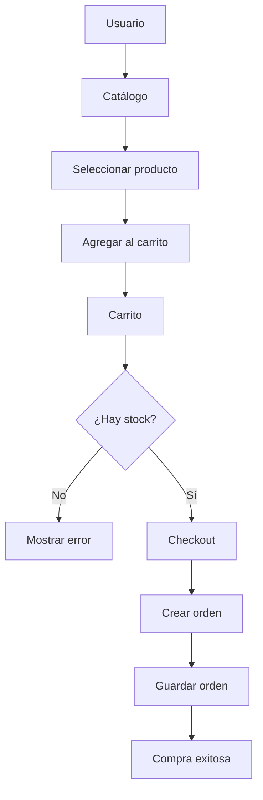

Este diagrama permite visualizar rápidamente el recorrido principal de una compra.

---

## 11.7. Ejemplo de autenticación

También podemos representar el proceso de autenticación de una aplicación.

### Código

```.md
flowchart TD
    A[Inicio] --> B{¿Usuario autenticado?}

    B -->|No| C[Mostrar Login]
    B -->|Sí| D[Obtener usuario]

    D --> E{¿Es administrador?}

    E -->|Sí| F[Panel Admin]
    E -->|No| G[Aplicación]

    C --> H[Ingresar credenciales]
    H --> I{¿Credenciales válidas?}

    I -->|Sí| D
    I -->|No| C
```

### Resultado

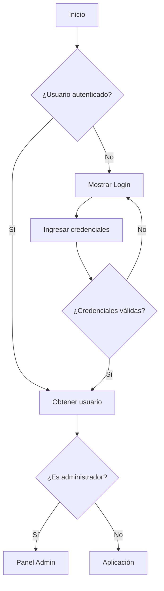

Podemos utilizar este tipo de diagrama para documentar la lógica de:

- Login.
- Registro.
- Roles.
- Protección de rutas.
- Permisos de administrador.

---

## 11.8. Ejemplo de arquitectura

Mermaid también puede utilizarse para representar la arquitectura de una aplicación.

### Código

```.md
flowchart TD
    UI[Componentes React]
    Context[Contextos]
    Service[Servicios]
    Firebase[(Firebase)]

    UI --> Context
    Context --> Service
    Service --> Firebase
```

### Resultado

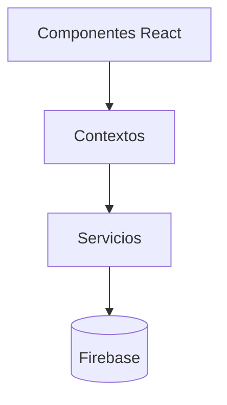

Este tipo de representación permite explicar cómo se comunican las diferentes capas de una aplicación.

Por ejemplo:

```text
Componentes
    ↓
Contextos
    ↓
Servicios
    ↓
Firebase
```

---

## 11.9. Ejemplo de flujo de una funcionalidad

Podemos utilizar un diagrama para analizar una funcionalidad antes de programarla.

Por ejemplo: **agregar un producto al carrito**.

### Código

```.md
flowchart TD
    A[Usuario] --> B[Click en Agregar al carrito]

    B --> C{¿Está autenticado?}

    C -->|No| D[Solicitar registro]
    C -->|Sí| E[Obtener producto]

    E --> F{¿Hay stock?}

    F -->|No| G[Deshabilitar acción]
    F -->|Sí| H[Dispatch ADD_ITEM]

    H --> I[Actualizar CartContext]
    I --> J[Actualizar interfaz]
```

### Resultado

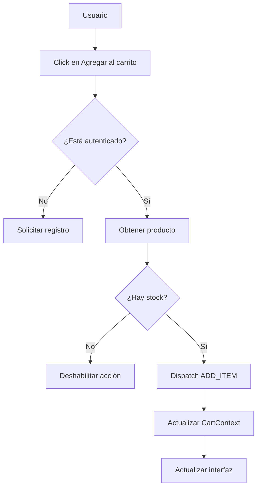

Este tipo de diagrama puede ayudar a determinar qué componentes y capas necesitamos antes de comenzar a programar.

---

## 11.10. Pensar antes de programar

Los diagramas de flujo son una herramienta útil para transformar un problema en una serie de pasos.

Podemos pensar el proceso de esta manera:

```text
Problema
   ↓
Analizar requisitos
   ↓
Identificar pasos
   ↓
Identificar decisiones
   ↓
Crear diagrama
   ↓
Definir arquitectura
   ↓
Programar
   ↓
Probar
```

También podemos representarlo mediante Mermaid:

### Código

```.md
flowchart TD
    A[Problema] --> B[Analizar requisitos]
    B --> C[Identificar pasos]
    C --> D[Identificar decisiones]
    D --> E[Crear diagrama]
    E --> F[Definir arquitectura]
    F --> G[Programar]
    G --> H[Probar]
```

### Resultado

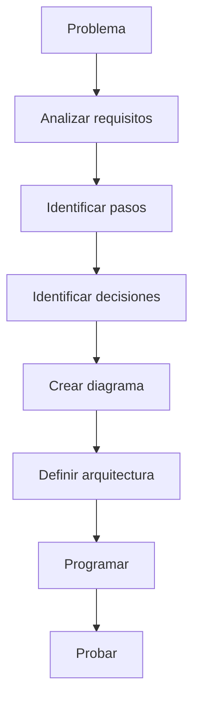

> 💡 **Consejo:** Antes de comenzar a programar una funcionalidad compleja, intenta representarla mediante un diagrama de flujo. Esto ayuda a detectar decisiones, errores y pasos faltantes antes de escribir código.

---

## 11.11. Elementos básicos de Mermaid

| Elemento          | Sintaxis       | Uso                           |
| ----------------- | -------------- | ----------------------------- |
| Proceso           | `[Texto]`      | Acción o proceso              |
| Decisión          | `{Texto}`      | Condición                     |
| Conexión          | `-->`          | Conectar elementos            |
| Texto en conexión | `-->\|Sí\|`    | Indicar una condición         |
| Flujo vertical    | `flowchart TD` | Arriba → abajo                |
| Flujo horizontal  | `flowchart LR` | Izquierda → derecha           |
| Base de datos     | `[(Texto)]`    | Representar una base de datos |

---

## 11.12. Ejemplo mínimo

### Código

```.md
flowchart TD
    A[Inicio] --> B{¿Condición?}
    B -->|Sí| C[Proceso A]
    B -->|No| D[Proceso B]
```

### Resultado

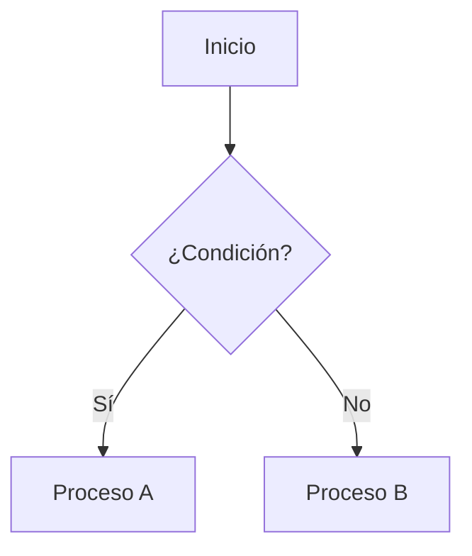

Este esquema puede utilizarse como punto de partida para crear prácticamente cualquier diagrama de flujo sencillo.

---

## 11.13. Buenas prácticas

Al crear diagramas de flujo:

- Mantener los textos cortos.
- Evitar diagramas excesivamente grandes.
- Utilizar nombres descriptivos.
- Separar procesos complejos en varios diagramas.
- Utilizar decisiones únicamente cuando exista una condición.
- Mantener una dirección de flujo clara.
- Utilizar los diagramas para explicar la lógica, no para reemplazar el código.
- Actualizar los diagramas cuando cambie la arquitectura o el funcionamiento del sistema.

Un buen diagrama debería permitir comprender la lógica general de un proceso sin necesidad de leer todo el código.

---

## 11.14. Recursos

Documentación oficial de Mermaid:

https://mermaid.js.org/

Documentación de diagramas de flujo:

https://mermaid.js.org/syntax/flowchart.html

---

[⬅️ Volver al README](../../README.md)
