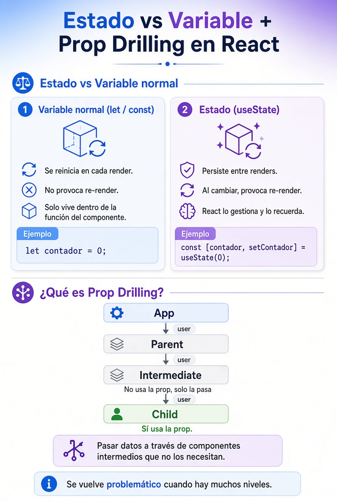
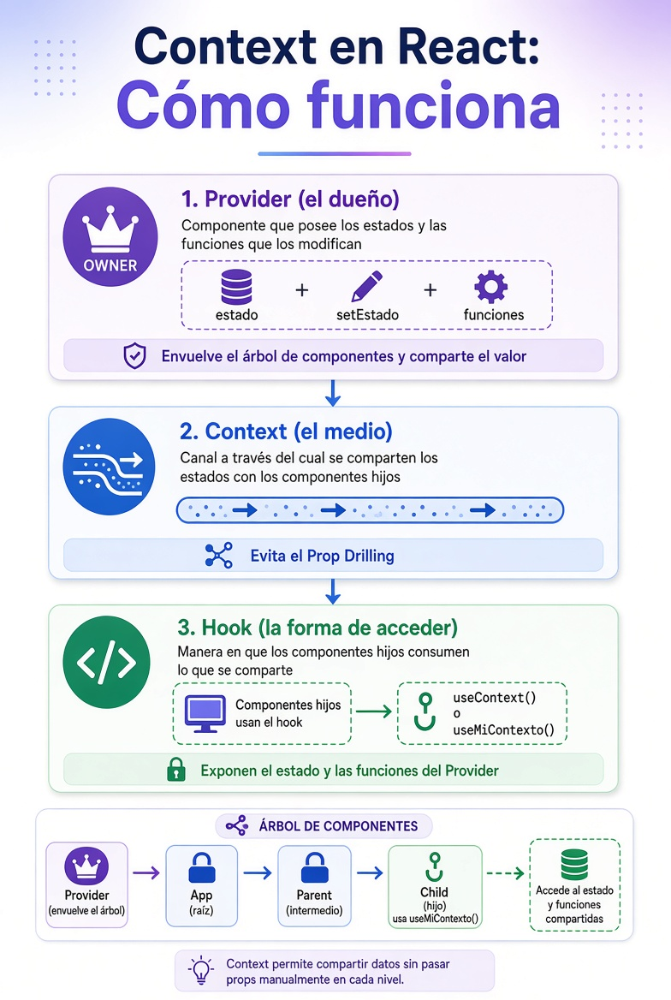
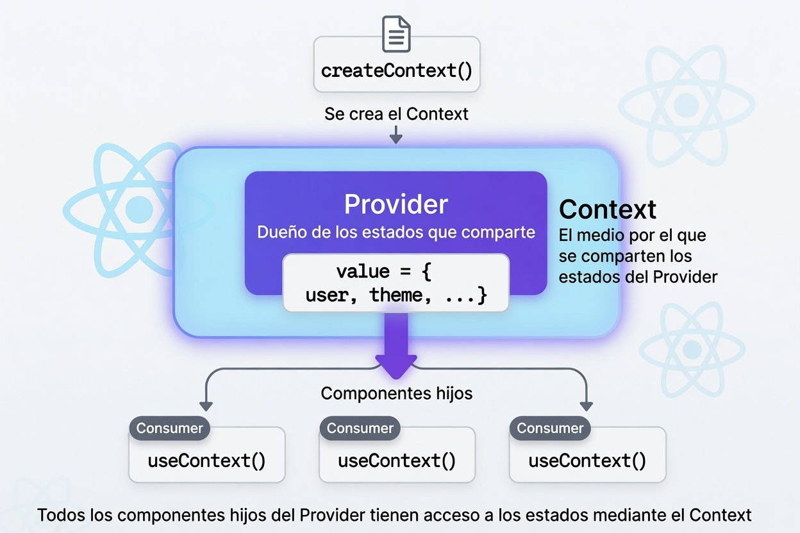

# Arquitectura de Proyecto en React

[⬅️ Volver al README](../../README.md)

## 💡 Decisiones Arquitectónicas y Uso de IA

Durante el diseño de la arquitectura del proyecto se utilizaron herramientas de IA como apoyo para explorar alternativas, analizar ventajas y desventajas, y conocer convenciones utilizadas en la industria.

Es importante destacar que:

- La IA no tomó las decisiones finales.
- Las recomendaciones fueron evaluadas críticamente.
- Algunas sugerencias fueron aceptadas y otras descartadas según los objetivos del proyecto.
- La arquitectura elegida prioriza la claridad didáctica por encima de la escalabilidad extrema o patrones avanzados.

## Recomendaciones evaluadas

### ✅ Utilizar una estructura funcional (Layer-Based)

La IA recomendó una estructura basada en tipos de archivos:

```txt
src/
├── components/
├── pages/
├── hooks/
├── contexts/
├── services/
├── types/
└── utils/
```

**Motivo de aceptación:**

- Es simple de comprender.
- Facilita el aprendizaje de React.
- Permite localizar rápidamente cada responsabilidad.
- Ideal para comenzar en React.

---

### ⚠️ Utilizar una estructura modular (Feature-Based)

La IA sugirió organizar el proyecto por funcionalidades:

```txt
src/
├── features/
│   ├── auth/
│   ├── products/
│   ├── cart/
│   └── orders/
```

**Motivo de descarte (por ahora):**

- Aunque es una excelente opción para proyectos grandes, agrega complejidad innecesaria para alumnos principiantes.
- Dificulta identificar rápidamente dónde se encuentra cada concepto durante las primeras etapas de aprendizaje.

---

### ⚠️ Utilizar una arquitectura híbrida

También se evaluó una arquitectura híbrida:

```txt
src/
├── features/
├── shared/
└── app/
```

**Motivo de descarte (por ahora):**

- Es una de las arquitecturas más utilizadas actualmente en proyectos profesionales.
- Sin embargo, introduce conceptos adicionales que pueden distraer del aprendizaje de React, TypeScript y Context API.

---

### ✅ Mantener Context, Provider y Hook separados

La IA propuso separar las responsabilidades de cada contexto:

```txt
cart/
├── CartContext.tsx
├── CartProvider.tsx
├── useCart.ts
└── cart.types.ts
```

**Motivo de aceptación:**

- Favorece la separación de responsabilidades.
- Facilita el mantenimiento.
- Hace más clara la función de cada archivo.
- Permite reutilizar patrones entre distintos contextos.

---

### ✅ Incorporar AppProviders

La IA recomendó centralizar todos los Providers en un único componente:

```tsx
<AppProviders>
    <App />
</AppProviders>
```

**Motivo de aceptación:**

- Evita anidaciones excesivas en `main.tsx`.
- Facilita agregar o quitar Providers.
- Escala mejor a medida que crece la aplicación.

---

## Decisión final

La arquitectura seleccionada busca un equilibrio entre:

- Simplicidad.
- Escalabilidad.
- Claridad didáctica.
- Buenas prácticas utilizadas en proyectos reales.

Por este motivo se adopta una estructura funcional enriquecida con algunas ideas provenientes de arquitecturas modulares.

```txt
src/
  │
  ├── components/
  │   ├── ui/
  │   ├── layout/
  │   └── common/
  │
  ├── pages/
  │   ├── auth/
  │   └── products/
  │
  ├── contexts/
  │ ├── cart/
  │ │ ├── CartProvider.tsx
  │ │ ├── CartContext.tsx
  │ │ ├── useCart.ts
  │ │ ├── cart.types.ts
  │ │ └── index.ts
  │ │
  │ └── AppProviders.tsx
  │
  ├── hooks/
  │
  ├── services/
  │   ├── auth.service.ts
  │   ├── products.service.ts
  │   └── orders.service.ts
  │
  ├── routes/
  │   ├── AppRouter.tsx
  │   ├── ProtectedRoute.tsx
  │   └── routes.ts
  │
  ├── layouts/
  │   ├── MainLayout.tsx
  │   ├── AuthLayout.tsx
  │   └── DashboardLayout.tsx
  │
  ├── types/
  |   └── product.types.ts
  ├── utils/
  │
  ├── App.tsx
  └── main.tsx
```

---

## Convención de nombres

- Carpetas (camelCase): `products/`, `productForm/`
- Componentes (PascalCase.tsx): `ProductCard.tsx`, `ProductForm.tsx`
- Contextos:
    - NombreContext.tsx: `ProductContext.tsx`
    - NombreProvider.tsx: `ProductProvider.tsx`
    - nombreReducer.ts: `productReducer.ts`
- Hooks (useNombre.ts): `useProducts.ts`
- Servicios (feature.service.ts): `products.service.ts`
- Tipos (feature.types.ts): `product.types.ts`

## 📝 Convención para nombrar commits

Los commits deben describir claramente qué cambio se realizó.

### Objetivos

- Facilitar la lectura del historial.
- Entender rápidamente qué se modificó.
- Mantener consistencia en el equipo.
- Facilitar revisiones y debugging.

---

### Formato

```txt
tipo: descripción breve
```

Ejemplos:

```txt
feat: agregar contexto de productos
feat: implementar carrito de compras
fix: corregir cálculo del total
refactor: reorganizar estructura de contextos
docs: agregar documentación de arquitectura
style: mejorar estilos del formulario
```

---

### Tipos más utilizados

| Tipo     | Uso                                         |
| -------- | ------------------------------------------- |
| feat     | Nueva funcionalidad                         |
| fix      | Corrección de errores                       |
| refactor | Reestructuración sin cambiar comportamiento |
| docs     | Cambios en documentación                    |
| style    | Cambios visuales o de formato               |
| test     | Agregar o modificar pruebas                 |
| chore    | Tareas de mantenimiento                     |

---

### Buenos ejemplos

```txt
feat: crear ProductsProvider
feat: agregar hook useProducts
fix: corregir eliminación de productos del carrito
docs: documentar estructura de carpetas
refactor: separar CartProvider del contexto
```

---

### Malos ejemplos

```txt
cambios
arreglado
nuevo
actualización
cosas varias
```

Los commits deben permitir entender qué ocurrió sin necesidad de abrir el código.

---

## Estados & Props

<div style="text-align: center;">
  
</div>

## Context

<div style="text-align: center;">
  
</div>

<br/>

<div style="text-align: center;">
  
</div>

---

[⬅️ Volver al README](../../README.md)
