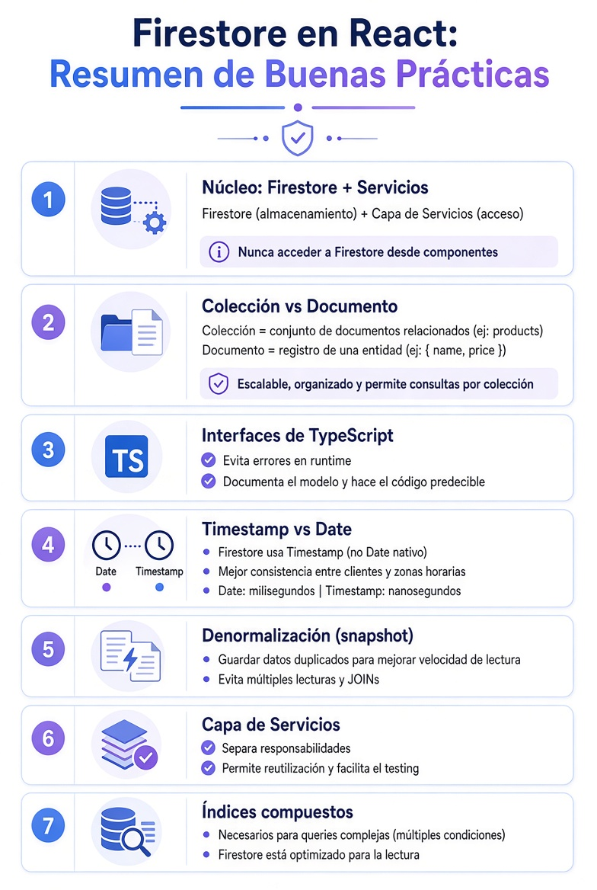

# Diseño de datos en Firestore

## ¿Qué es una API? 🌐

[⬅️ Volver al README](../../README.md)

- **API (Application Programming Interface)** es una interfaz que permite la comunicación entre distintas partes de un software.
- Su idea fundamental es:
    - Un software expone funcionalidades o capacidades.
    - Otro software las utiliza sin necesidad de conocer su implementación interna.
- Una API puede representar:
    - Una función.
    - Un conjunto de funciones.
    - Una biblioteca o framework.
    - Un servicio o backend completo.
- Por eso suele decirse que una API es un **contrato de uso**, ya que define qué se puede utilizar y cómo hacerlo, sin revelar los detalles internos de funcionamiento.
- En aplicaciones web, cuando hablamos de **consumir una API**, normalmente nos referimos a comunicarnos con un servidor mediante HTTP para obtener o enviar datos.
- En React y en el desarrollo frontend, el término API tiene un significado más amplio: es cualquier conjunto de funciones, hooks, componentes o propiedades que una librería pone a disposición del desarrollador.
    - La API de React incluye elementos como `useState`, `useEffect`, `useContext`, `useMemo`, entre otros.
- Un **Provider** también puede considerarse una API interna de la aplicación:
    - Expone estados, datos y funcionalidades compartidas mediante Context.
    - Otros componentes acceden a esos recursos a través de hooks personalizados o directamente mediante `useContext`.
- De forma similar, **React Router** ofrece su propia API, compuesta por componentes y hooks como: `BrowserRouter`, `Routes`, `Route`, `Link`, `useNavigate`, `useParams`, `useLocation`.
- **En resumen**:
    - **Una API es el conjunto de funcionalidades que un software expone para que otros puedan interactuar con él.**
    - Lo importante no es cómo está implementada internamente, sino qué operaciones permite realizar y la forma correcta de utilizarlas.

---

## Firestore 🔥

  

### Resumen

- Nunca invocamos a Firestore desde componentes → siempre mediante la capa de servicios.
- Colección = grupo de documentos | Documento = un registro.
- Interfaces y Tipos de TypeScript = seguridad + documentación del modelo.
- Firestore usa Timestamp (no Date): Precisión de nanosegundos y formato propio.
- Denormalización (snapshots) para lecturas rápidas: Duplicación de datos.
- La capa de servicios separa responsabilidades y facilita el testing.
- Se requieren índices compuestos para queries con varias condiciones.

---

[⬅️ Volver al README](../../README.md)
