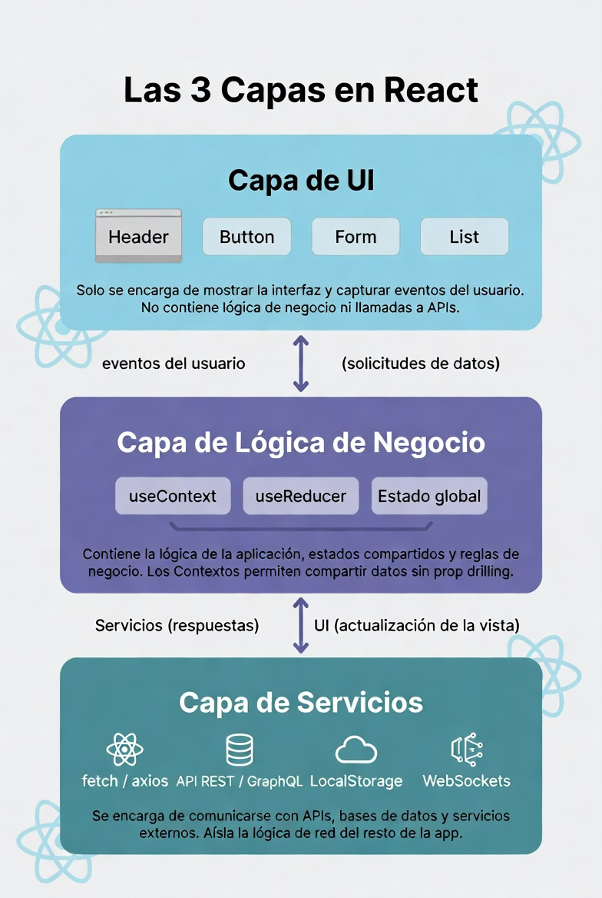
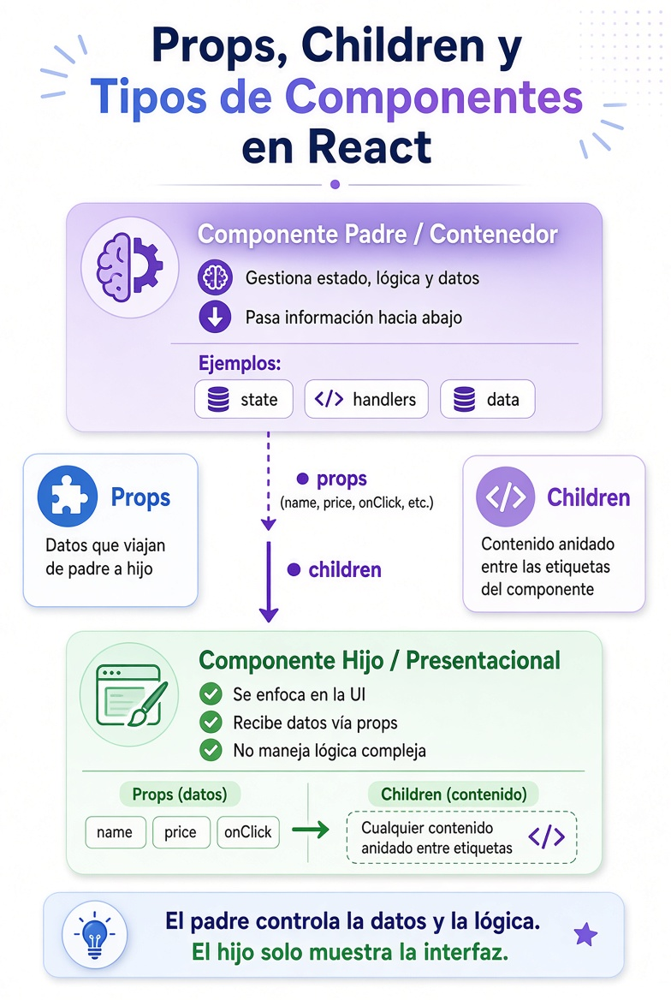

# Props avanzadas & Componentes reutilizables

[⬅️ Volver al README](../../README.md)

## ⚛️ Capas (layers) en React

<div style="text-align: center;">
  
</div>

### 🖥️ 1. UI

**Muestra e interactúa.**

```text
components/
pages/
```

```tsx
<ProductCard product={product} onAdd={addToCart} />
```

### 🧠 2. Estado / Lógica

**Decide qué debe hacer la aplicación y guarda los datos en el Frontend.**

```text
contexts/
hooks/
```

```tsx
const { items, addToCart } = useCart();
```

### 🔌 3. Servicios

**Se comunica con sistemas externos.**

```text
services/
```

```ts
const products = await getProducts();
```

---

### 📐 Types

> Si bien no es una capa en sí, define toda la arquitectura del dominio (users, products, orders, etc).

**Define la forma de los datos.**

```text
types/
```

```ts
interface Product {
    id: number;
    name: string;
    price: number;
}
```

### Regla rápida

| Capa          | Pregunta                        |
| ------------- | ------------------------------- |
| UI            | ¿Cómo lo mostramos?             |
| Estado/Lógica | ¿Qué debe hacer?                |
| Servicios     | ¿Cómo obtenemos/enviamos datos? |
| Types         | ¿Qué forma tienen los datos?    |

---

## ⚛️ React + TypeScript — Componentes, Props y Children

<div style="text-align: center;">
  
</div>

### 1. Padre e hijo

Un componente puede **renderizar a otro componente**.

```tsx
function Parent() {
    return <Child />;
}

function Child() {
    return <p>Soy el hijo</p>;
}
```

Flujo:

```text
Parent
  ↓
Child
```

---

### 2. Componentes contenedores y presentacionales

#### Contenedor

Se ocupa de la **lógica y los datos**.

```tsx
function ProductList() {
    const products = getProducts();

    return <ProductListView products={products} />;
}
```

#### Presentacional

Se ocupa principalmente de **mostrar los datos**.

```tsx
interface Props {
    products: Product[];
}

function ProductListView({ products }: Props) {
    return (
        <ul>
            {products.map((product) => (
                <li key={product.id}>{product.title}</li>
            ))}
        </ul>
    );
}
```

Conceptualmente:

```text
Contenedor
 ├── obtiene datos
 ├── maneja lógica
 └── ↓ props
     Presentacional
       └── muestra UI
```

---

### 3. Props

Las **props** permiten pasar datos del padre al hijo.

```tsx
interface Product {
    id: number;
    title: string;
    price: number;
}

interface ProductCardProps {
    product: Product;
}

function ProductCard({ product }: ProductCardProps) {
    return (
        <article>
            <h3>{product.title}</h3>
            <p>${product.price}</p>
        </article>
    );
}
```

El padre pasa la prop:

```tsx
function ProductList() {
    const product = {
        id: 1,
        title: "Notebook",
        price: 1000,
    };

    return <ProductCard product={product} />;
}
```

#### Varias props

```tsx
interface Props {
    title: string;
    price: number;
    available: boolean;
}

function ProductCard({ title, price, available }: Props) {
    // ...
}
```

```tsx
<ProductCard title="Notebook" price={1000} available={true} />
```

---

### 4. Props de funciones

También podemos pasar **funciones**.

```tsx
interface Props {
    title: string;
    onAdd: () => void;
}

function ProductCard({ title, onAdd }: Props) {
    return (
        <article>
            <h3>{title}</h3>

            <button onClick={onAdd}>Agregar</button>
        </article>
    );
}
```

Padre:

```tsx
function ProductList() {
    const addToCart = () => {
        console.log("Agregado");
    };

    return <ProductCard title="Notebook" onAdd={addToCart} />;
}
```

Esto permite que el **hijo dispare lógica definida por el padre**.

```text
Padre
  │
  │ onAdd={addToCart}
  ↓
Hijo
  │
  │ onAdd()
  ↓
Padre ejecuta addToCart()
```

---

### 5. `children`

`children` permite pasar **contenido entre las etiquetas** del componente.

```tsx
interface Props {
    children: React.ReactNode;
}

function Card({ children }: Props) {
    return <div className="card">{children}</div>;
}
```

Uso:

```tsx
<Card>
    <h2>Producto</h2>
    <p>Notebook gamer</p>
</Card>
```

El contenido:

```tsx
<h2>Producto</h2>
<p>Notebook gamer</p>
```

llega al componente como:

```tsx
children;
```

---

### 6. `children` puede ser un componente

```tsx
<Card>
    <ProductCard product={product} />
</Card>
```

Conceptualmente:

```text
Card
 └── children
      └── ProductCard
```

Esto permite crear componentes contenedores muy reutilizables.

---

### 7. Props vs children

#### Props

Para datos/configuración específicos:

```tsx
<ProductCard product={product} onAdd={addToCart} />
```

#### Children

Para contenido que el componente debe envolver:

```tsx
<Card>
    <ProductCard product={product} />
</Card>
```

Regla práctica:

```text
¿Qué dato/configuración necesita?
        ↓
       props

¿Qué contenido quiero colocar dentro?
        ↓
      children
```

---

### 8. Ejemplo completo

```tsx
interface Product {
    id: number;
    title: string;
    price: number;
}

interface ProductCardProps {
    product: Product;
    onAdd: (product: Product) => void;
}

function ProductCard({ product, onAdd }: ProductCardProps) {
    return (
        <article>
            <h3>{product.title}</h3>
            <p>${product.price}</p>

            <button onClick={() => onAdd(product)}>Agregar al carrito</button>
        </article>
    );
}
```

Padre:

```tsx
function ProductList() {
  const products: Product[] = [...]

  const addToCart = (product: Product) => {
    console.log(product)
  }

  return (
    <section>
      <h2>Productos</h2>

      {products.map(product => (
        <ProductCard
          key={product.id}
          product={product}
          onAdd={addToCart}
        />
      ))}
    </section>
  )
}
```

Flujo:

```text
ProductList
   │
   ├── product ────────→ ProductCard
   │
   └── onAdd ──────────→ ProductCard
                              │
                              │ usuario hace click
                              ↓
                         onAdd(product)
                              │
                              ↓
                       ProductList
```

**Idea fundamental:** en React, los datos normalmente fluyen **de padre → hijo mediante props**. `children` es una forma especial de prop para pasar contenido anidado.

---

[⬅️ Volver al README](../../README.md)
