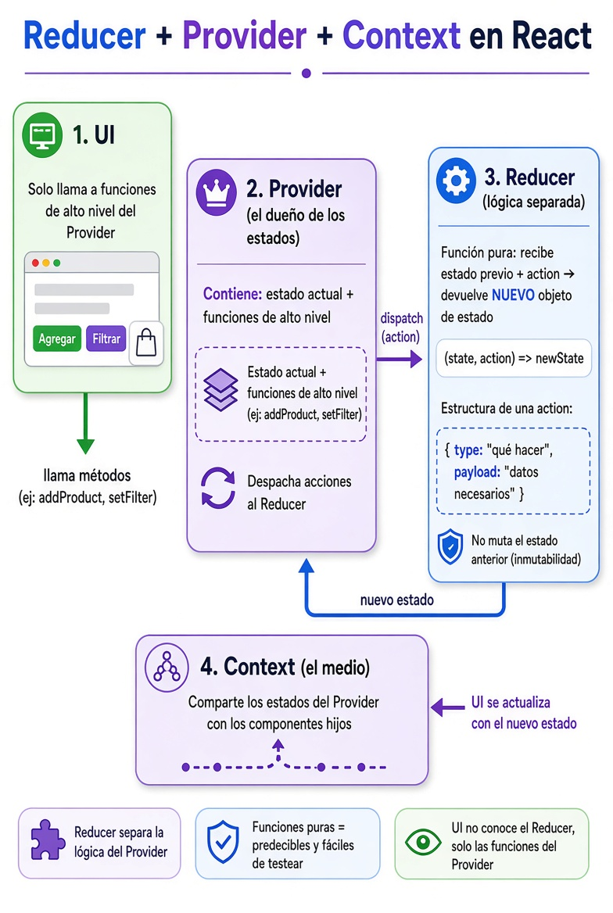

# Reducers en React

[⬅️ Volver al README](../../README.md)

## React Context & Reducer:

- El Provider es el componente que crea, administra y comparte el estado global con todos sus componentes hijos.
- El Contexto actúa como un canal por el que el Provider entrega el estado y las funciones a los componentes consumidores.
- El Provider administra el estado global y comparte tanto los datos como las funciones necesarias para modificarlos.
- Los componentes consumidores leen la información del Context y utilizan las funciones que el Provider comparte.

- ¿Cuándo usar un Provider?
    - Si un estado solamente es utilizado por un componente (o unos pocos muy cercanos), normalmente conviene mantenerlo como estado local.
    - Cuando muchos componentes necesitan acceder al mismo estado, un Context evita tener que pasar props por muchos niveles (prop drilling).

- ¿Cuándo usar un Reducer?
    - Cuando existen muchas formas de modificar un estado o la lógica comienza a crecer, es recomendable centralizar esas modificaciones en un Reducer.
    - El Reducer concentra toda la lógica que describe cómo cambia el estado ante distintas acciones.

## Flujo de Trabajo utilizando Context

```txt
Usuario
↓
Interacción en UI
(click, submit, input, etc.)

Componente
↓
Invoca funciones expuestas por el Provider

Provider
(Concentra estado y lógica)
↓
Ejecuta funciones que actualizan el estado (setState)

React
↓
Reemplaza el estado anterior: state → newState

Context Provider
↓
Actualiza el value compartido

Componentes consumidores
↓
Se re-renderizan automáticamente
```

## Flujo de Trabajo utilizando Context + Reducer

<div style="text-align: center;">
  
</div>
<br/>

```txt
Usuario
  ↓
Interacción en UI: (click, submit, input, etc.)

Componente
  ↓
Invoca una función de alto nivel (addItem, removeItem, clearCart)

Provider
  ↓
Construye una Action: { type, payload }

dispatch(action)
  ↓
React ejecuta el Reducer

Reducer
  ↓
Función pura: (state, action) → newState

React
  ↓
Reemplaza el estado anterior: state → newState

Context Provider
  ↓
Actualiza el value compartido

Componentes consumidores del Contexto
  ↓
Se re-renderizan automáticamente
```

### Resumen Reducer:

1. UI → Solo llama a funciones de alto nivel del Provider (ej: addProduct(), setFilter()).
2. Provider → Es el dueño del estado. Internamente hace dispatch de una acción.
3. Reducer → Función pura que recibe:
   |- Una copia del estado anterior
   |- Una acción { type, payload }
   |- Y siempre devuelve un nuevo objeto de estado (nunca muta el anterior).
4. Context → Sigue siendo el canal por el que se comparten los estados actualizados a los componentes hijos.
5. La UI se re-renderiza con el nuevo estado.

Ventajas clave:

- Lógica de negocio separada y fácil de testear
- Provider más limpio
- Estado inmutable y predecible

---

[⬅️ Volver al README](../../README.md)
