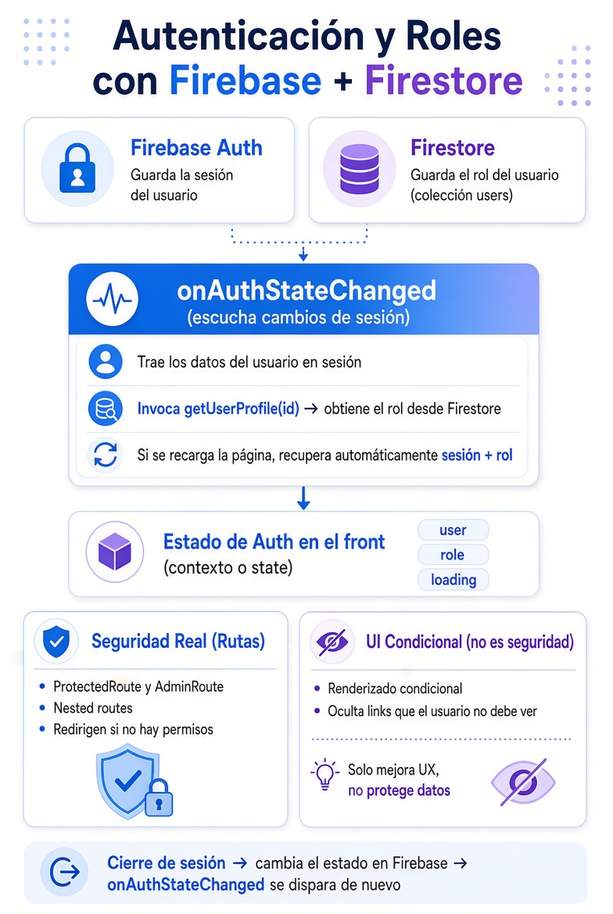

# Autenticación con Firebase y Roles

[⬅️ Volver al README](../../README.md)

## 🔄 Flujo General:

  

 

## 📌 Resumen:

1. Firebase Auth → Maneja la sesión del usuario.
2. Firestore → Guarda el rol del usuario (en la colección users).
3. onAuthStateChanged:
    - Se ejecuta al iniciar sesión, al recargar la página o al cerrar sesión.
    - Trae los datos de sesión y llama a getUserProfile para obtener el rol.
4. ProtectedRoute / AdminRoute → Seguridad real (redirección si no tienes permisos).
5. Renderizado condicional → Solo oculta links (no es seguridad real).
6. Cerrar sesión → Cambia el estado en Firebase y vuelve a disparar onAuthStateChanged.

---

[⬅️ Volver al README](../../README.md)
