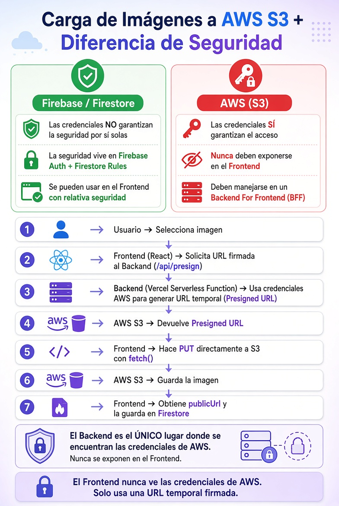

# Panel de Administrador & AWS S3

[⬅️ Volver al README](../../README.md)

## ⚙️ Configuración del Servicio S3 de AWS

### 1. Instalación de Dependencias

```bash
npm install @aws-sdk/client-s3
npm install @aws-sdk/s3-request-presigner
npm install @vercel/node
```

### 2. Variables de Entorno

```.env
AWS_ACCESS_KEY_ID=your_access_key
AWS_SECRET_ACCESS_KEY=your_secret_access_key
AWS_REGION=aws_region
S3_BUCKET=your_s3_bucket
```

### 3. Creación del Bucket

- Desde la consola de AWS: S3
- ⚠️Copiar las credenciales en el proceso, luego no se vuelven a mostrar.

### 4. Configuración de CORS en S3

```json
[
    {
        "AllowedHeaders": ["*"],
        "AllowedMethods": ["PUT", "GET"],
        "AllowedOrigins": ["http://localhost:3000"],
        "ExposeHeaders": []
    }
]
```

### 5. Configuración de "Políticas de bucket

```json
{
    "Version": "2012-10-17",
    "Statement": [
        {
            "Sid": "PublicReadImages",
            "Effect": "Allow",
            "Principal": "*",
            "Action": "s3:GetObject",
            "Resource": "arn:aws:s3:::demo-ecommerce-admin-panel/*"
        }
    ]
}
```

## 🔐 Reglas de Firestone (Firestone Rules)

- Son reglas que definen quién puede acceder a los datos de Firestore y qué puede hacer con ellos.
- Sirven para controlar y proteger operaciones de lectura, creación, actualización y eliminación.
- Se ejecutan en el servidor de Firebase, por lo que no se debe confiar únicamente en validaciones del frontend.
- Podemos endurecerlas y utilizar las siguientes:

```ts
rules_version = '2';

service cloud.firestore {
	match /databases/{database}/documents {

	// PRODUCTS
	match /products/{productId} {

		// lectura pública
		allow read: if false;

		// solo admins pueden escribir
		allow write: if isAdmin();
	}

	// USERS
	match /users/{userId} {

		// cada usuario solo lee su perfil
		allow read:
			if request.auth != null
			&& request.auth.uid == userId;

		// nadie escribe directamente
		allow write: if false;
	}

	// ADMIN CHECK
	function isAdmin() {
		return request.auth != null
			&& get(
				/databases/$(database)/documents/users/$(request.auth.uid)
			).data.role == "admin";
		}
	}
}
```

---

## AWS S3 Presigned URL + Variables de Entorno + Firebase

### 🛡️ 1. Diferencias de seguridad

- Nunca incluimos credenciales sensibles en el código fuente ni en el bundle, ya que pueden quedar expuestas al usuario (accesibles desde el navegador).
- Firebase/Firestore: Las credenciales por sí solas no dan acceso total. La seguridad real está en Auth + Rules.
- AWS S3: Las credenciales sí dan acceso completo. Por eso nunca deben estar en el Frontend. Se manejan en un Backend For Frontend.
- Una **Presigned URL** es una URL temporal firmada digitalmente que permite realizar una operación específica sobre un archivo en S3 sin exponer credenciales de AWS al cliente.

### 🔄 2. Flujo de carga de imágenes en AWS S3

<div style="text-align: center;">
  
</div>
<br/>

1. Usuario selecciona imagen
2. Frontend pide una Presigned URL al Backend
3. Backend (con credenciales seguras) genera la URL temporal
4. Frontend sube la imagen directamente a S3
5. S3 guarda la imagen
6. Frontend obtiene la publicUrl y la guarda en Firestore

⚠️ De este modo las credenciales de AWS nunca se exponen.

---

[⬅️ Volver al README](../../README.md)
