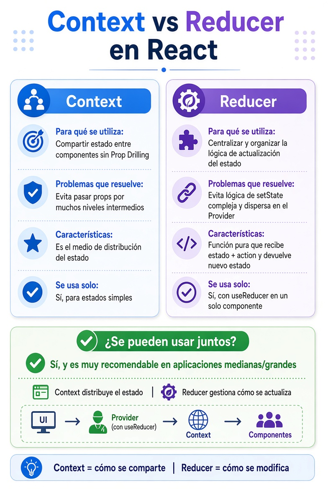

# useState, Context & Reducer

[⬅️ Volver al README](../../README.md)

## ¿Cuándo es necesario un Contexto o un Reducer?

Es una de las decisiones de arquitectura más importantes en React.

  

 

Una regla práctica es pensar en **tres preguntas**:

1. **¿El estado necesita compartirse entre varios componentes?**
2. **¿La lógica para modificar ese estado es simple o compleja?**
3. **¿Necesitamos evitar pasar props a través de muchos componentes?**

---

## ¿Qué herramienta utilizar?

| Situación                                             | `useState` | Context | Reducer |
| ----------------------------------------------------- | :--------: | :-----: | :-----: |
| Estado usado por un solo componente                   |     ✅     |   ❌    |   ❌    |
| Estado local con lógica compleja                      |     ❌     |   ❌    |   ✅    |
| Estado simple compartido entre componentes            |     ❌     |   ✅    |   ❌    |
| Estado complejo compartido entre componentes          |     ❌     |   ✅    |   ✅    |
| Estado simple que se puede pasar fácilmente por props |     ✅     |   ❌    |   ❌    |
| Estado global con muchas transiciones relacionadas    |     ❌     |   ✅    |   ✅    |

---

## Resumen

| Aspecto                   | **Context**                                          | **Reducer**                                                          |
| ------------------------- | ---------------------------------------------------- | -------------------------------------------------------------------- |
| **Para qué se utiliza**   | Compartir estado entre componentes sin Prop Drilling | Centralizar y organizar la lógica de actualización del estado        |
| **Problema que resuelve** | Evita pasar props por muchos niveles intermedios     | Evita lógica de `setState` compleja y dispersa en el Provider        |
| **Características**       | Es el medio de distribución del estado               | Función pura que recibe `estado + action` y devuelve un nuevo estado |
| **Se puede usar solo**    | Sí, para estados simples                             | Sí, con `useReducer` en un solo componente                           |
| **Se pueden usar juntos** | Sí (muy recomendable en apps medianas/grandes)       | Context distribuye el estado + Reducer gestiona cómo se actualiza    |

## Regla práctica:

- Solo necesitas compartir datos → Context
- La lógica de actualización se complica → agrega Reducer
- Ambos juntos = estado global limpio y predecible

---

[⬅️ Volver al README](../../README.md)
