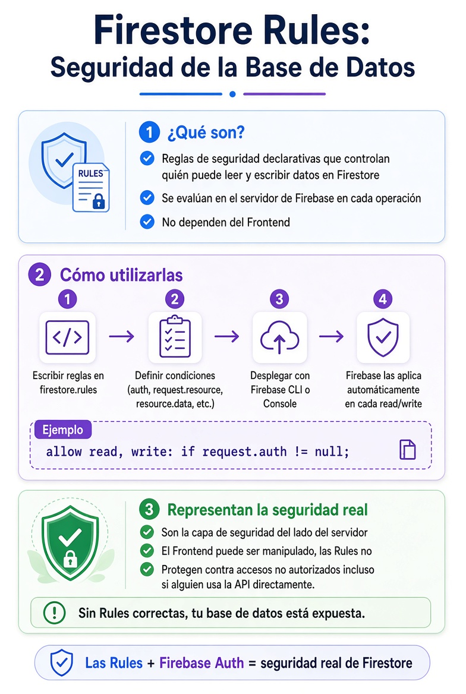

# Firestore Rules

[⬅️ Volver al README](../../README.md)

## Resumen sobre Firestore Rules

<div style="text-align: center;">
  
</div>
<br/>

- Qué son: Reglas de seguridad que Firebase evalúa en el servidor cada vez que alguien intenta leer o escribir datos.
- Cómo usarlas: Se escriben en firestore.rules, se definen condiciones (usuario autenticado, rol, dueño del documento, etc.) y se despliegan.
- Importancia: Representan la seguridad real de la base de datos. El Frontend se puede manipular, las Rules no.
- Sin Rules bien configuradas, cualquiera con tu projectId podría acceder a tus datos.

## Ejemplo completo de Firestore Rules

> IMPORTANTE: Este es un ejemplo funcional de Reglas para Firestone, puedes modificarlas para que se adapten a los requerimientos de tu proyecto.

```
rules_version = '2';

service cloud.firestore {
    match /databases/{database}/documents {

        //* HELPERS
        function isSignedIn() {
            return request.auth != null;
        }

        function isAdmin() {
            return isSignedIn()
                && exists(
                    /databases/$(database)/documents/users/$(request.auth.uid)
                )
                && get(
                    /databases/$(database)/documents/users/$(request.auth.uid)
                ).data.role == "admin";
        }

        //* PRODUCTS
        match /products/{productId} {

            //* Public catalog
            allow read: if true;

            //* Admin management
            allow create, update, delete:
                if isAdmin();
        }

        //* USERS
        match /users/{userId} {

            //* User can read own profile
            allow read:
                if isSignedIn()
                && request.auth.uid == userId;

            //* Managed internally
            allow write: if false;
        }


        //* ORDERS
        match /orders/{orderId} {

            //* User creates own order
            allow create:
                if isSignedIn()
                && request.resource.data.userId == request.auth.uid;


            //* Admin sees all orders
            //* User sees only own orders
            allow read:
                if isAdmin()
                || (
                    isSignedIn()
                    && resource.data.userId == request.auth.uid
                );


            //* Admin can update only order status
            allow update:
                if isAdmin()
                && request.resource.data
                    .diff(resource.data)
                    .affectedKeys()
                    .hasOnly([
                        "status",
                        "updatedAt",
                    ]);


            //* Orders are immutable
            allow delete: if false;
        }
    }
}
```

## Detalles de la Configuración

- `rules_version = '2';`
    - Usa la versión 2 del lenguaje de reglas de Firestore.
- `service cloud.firestore`
    - Define las reglas de seguridad para Firestore.
- `match /databases/{database}/documents`
    - Aplica las reglas a todos los documentos.

### Helpers

#### `isSignedIn()`

- Comprueba que el usuario esté autenticado.
- Devuelve `true` si `request.auth` existe.

#### `isAdmin()`

- Comprueba que el usuario esté autenticado.
- Busca su documento en `users/{uid}`.
- Devuelve `true` si `role == "admin"`.

### Colección `products`

#### `allow read: if true;`

- Cualquier persona puede leer los productos.
- No requiere iniciar sesión.

#### `allow write: if isAdmin();`

- Solo los administradores pueden crear, editar y eliminar productos.

### Colección `users`

#### `allow read`

- Solo un usuario autenticado puede leer su propio documento.

#### `allow write: if false;`

- Nadie puede modificar documentos de usuarios desde el cliente.

### Colección `orders`

#### Crear (`allow create`)

- Requiere autenticación.
- `userId` debe coincidir con el usuario autenticado.

#### Leer (`allow read`)

- Un administrador puede leer cualquier pedido.
- Un usuario solo puede leer sus propios pedidos.

#### Actualizar (`allow update`)

- Solo un administrador puede actualizar pedidos.
- Solo puede modificar:
    - `status`
    - `updatedAt`

#### Eliminar (`allow delete`)

- Nadie puede eliminar pedidos desde el cliente.

### Explicación de `diff()`

```js
request.resource.data
    .diff(resource.data)
    .affectedKeys()
    .hasOnly(["status", "updatedAt"]);
```

- Compara el documento nuevo con el actual.
- Obtiene los campos modificados.
- Permite la actualización únicamente si los únicos campos cambiados
  son `status` y `updatedAt`.

### Resumen

- ✅ Cualquiera puede consultar productos.
- ✅ Solo los administradores pueden gestionar productos.
- ✅ Cada usuario solo puede leer su propia información.
- ✅ Los usuarios pueden crear pedidos únicamente para sí mismos.
- ✅ Los usuarios solo pueden ver sus propios pedidos.
- ✅ Los administradores pueden ver todos los pedidos.
- ✅ Los administradores solo pueden actualizar `status` y
  `updatedAt`.
- ✅ Ningún pedido puede eliminarse desde el cliente.

---

[⬅️ Volver al README](../../README.md)
