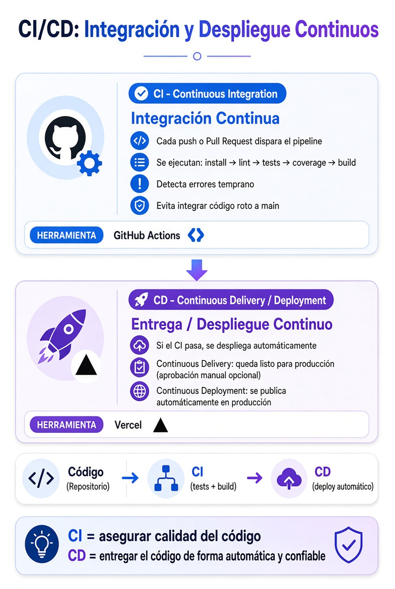
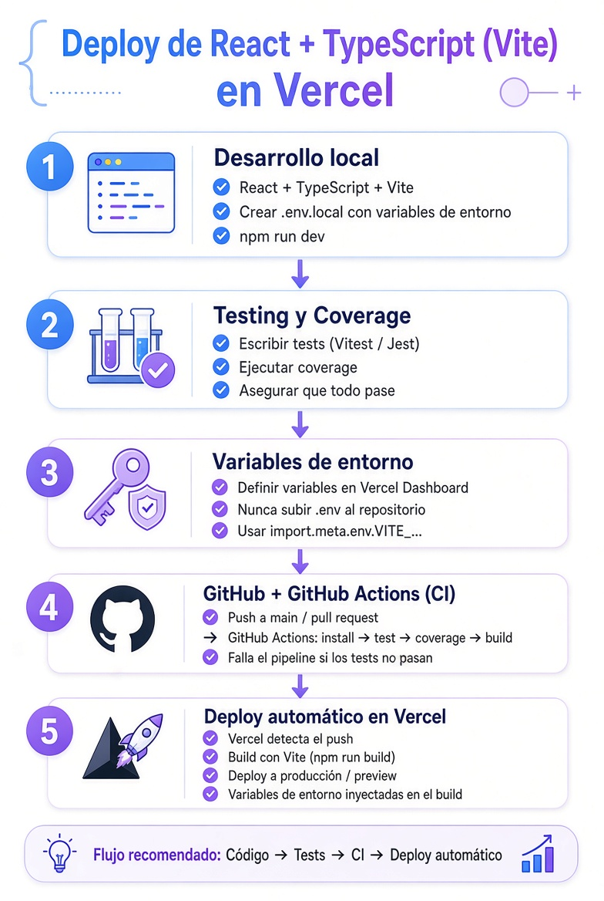

# Deployment

[⬅️ Volver al README](../../README.md)

## CI/CD: Integración Continua / Deploy Continuo

> Es un proceso que realiza el siguiente ciclo en forma contínua:

<div style="text-align: center;">
  
</div>
<br/>

## Resumen

| Concepto                          | Significado              | Objetivo principal                                      |
|-----------------------------------|--------------------------|---------------------------------------------------------|
| **CI** (Continuous Integration)   | Integración Continua     | Cada cambio se prueba automáticamente (tests, lint, build) |
| **CD** (Continuous Delivery)      | Entrega Continua         | El código queda siempre listo para ser desplegado      |
| **CD** (Continuous Deployment)    | Despliegue Continuo      | Se publica automáticamente en producción si todo pasa  |

- CI → GitHub Actions (tests + coverage + build)
- CD → Vercel hace el deploy automático cuando el CI es exitoso

## Paso a Paso para Deployar en Vercel

<div style="text-align: center;">
  
</div>
<br/>

### ➡️ 1. Generar un set adecuado de tests

- Testear las principales funcionalidades que incluyan:
  - UI
  - Autenticacion & Seguridad.
  - Lógica de Negocio (Impacto económico).
- Lograr un nivel aceptable de cobertura (Coverage).
  - Al menos el 85%, y que se incluyan funcionalidades importantes.
  - No es necesario llegar a la cobertura del 100%.

### ➡️ 2. Configurar el Workflow de Github

- Creamos en la raíz del proyecto:

```txt
./ (carpeta raíz)
 ├── .github/
 |    ├── workflows/
 │    |   ├── ci.yml
```

- Agregamos en el ARVHIVO ".github/workflows/ci.yml":
  - Reemplazar si es necesario rama principal y versión de node.

```yml
name: CI

on:
  push:
    branches:
      - main

  pull_request:
    branches:
      - main

jobs:
  test:
    runs-on: ubuntu-latest

    steps:
      # 1. Clona repositorio
      - name: Checkout repository
        uses: actions/checkout@v4

      # 2. Instala Node
      - name: Setup Node
        uses: actions/setup-node@v4
        with:
          node-version: 22

      # 3. Instala dependencias
      - name: Install dependencies
        run: npm ci

      # 4. Ejecuta tests
      - name: Run tests
        run: npm test

      # 5. Ejecuta coverage
      - name: Run coverage
        run: npm run test:coverage
```

### ➡️ 3. Referencia de ruta inicial en Vercel

- En el entorno local el routing de la SPA es manejada por React-Router-DOM.
- En Vercel, se pierde la referencia en la carga inicial o ante F5.
  - Vercel NO maneja paths internos de React-Router-DOM.
- Para ello indicamos la referencia para Vercel, dónde debe iniciar la carga:
  1. Creamos archivo "vercel.json" en la raíz del proyecto.
  2. En el archivo creado copiamos lo siguiente:

```json
{
  "rewrites": [
    {
      "source": "/(.*)",
      "destination": "/index.html"
    }
  ]
}
```

### ➡️ 4. Scripts necesarios para Vercel

- En ARCHIVO "package.json" Verificamos que Existan los siguientes Scripts:
  - Vercel correrá estos comandos en cada Deploy, ya sea el primero, o ante cambios en la rama principal.

```json
{
  "scripts": {
    // otros scripts...
    "build": "tsc -b && vite build",
    "test": "vitest run",
    "test:coverage": "vitest run --coverage"
```

### ➡️ 5. Correr build de prueba

- Corremos en terminal integrado el script:
  - La idea es corregir cualquier error que pueda surgir.
    - Si se trata de un warning (amarillo), podemos ignorarlo por ahora.
  - Si rompe en local, también romperá cuando Vercel lo ejecute.

```txt
npm run build
```

### ➡️ 6. Subir cambios a GitHub

- Subir nuestro proyecto a GitHub si aún no lo hemos hecho.
- Pusheamos los cambios al repositorio remoto, para dejar lista la última versión de nuestro código en GitHub.

```txt
git add .
git commit -m "aquí_tu_comentario"
git push
```

### ➡️ 7. Deploy en Vercel

1. Crear cuenta en Vercel si aún no lo hemos hecho.
2. Crear nuevo proyecto en Vercel.
3. Linkear el repositorio de GitHub al nuevo proyecto.
4. Cargar las variables de entorno: Nombre y Valor según archivo .env
5. Deployar.

---

[⬅️ Volver al README](../../README.md)
