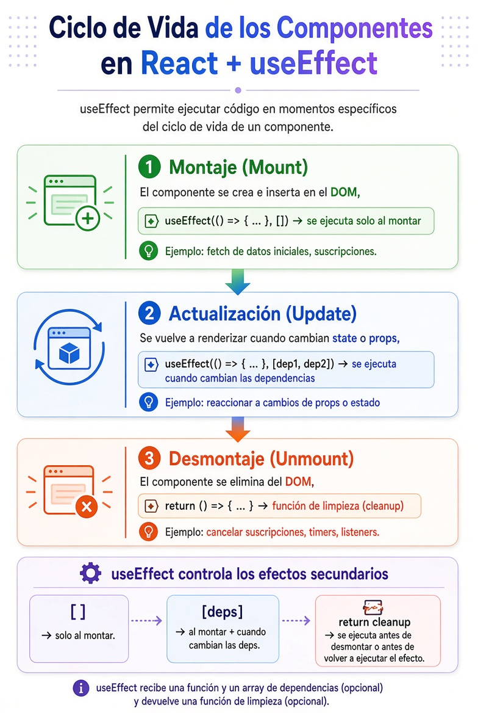
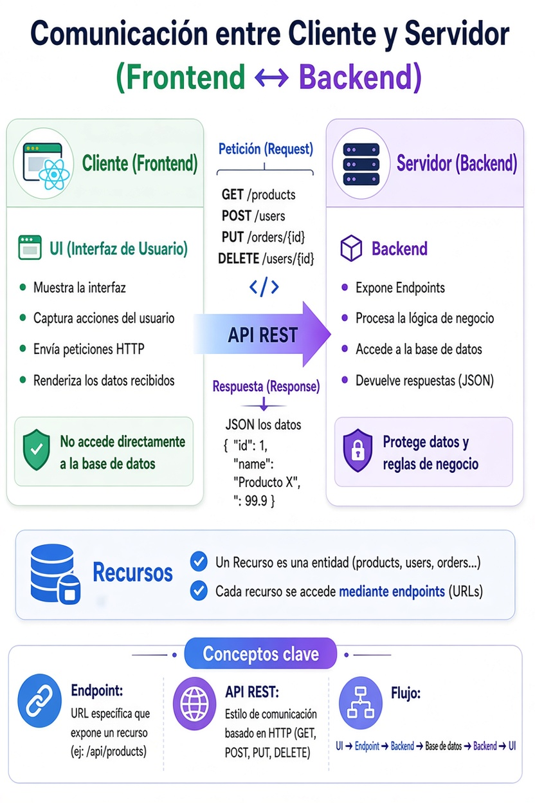

# Consultas & Repaso

[⬅️ Volver al README](../../README.md)

## 1. 🎯¿Qué es un Estado y cuándo utilizarlo? (useState)

- En React, un **estado (state)** es un valor que **puede cambiar a lo largo del tiempo** y cuyo cambio provoca que el componente se vuelva a renderizar para reflejar la nueva información en la interfaz.
- Los estados pueden ser simples (booleanos, números, strings) o datos realmente complejos como objetos anidados.
- Son ejemplos:
    - "isLoading", "error", "authUser", "products", "orders", etc.
- Los utilizamos para mostrar al usuario qué sucede en la aplicación mejorando su experiencia (UX):
    - Estamos buscando productos en Firestone: Cargando...
    - Estamos recuperando los datos del usuario logueado: Autenticando...
    - Estamos creando creando la orden de compra: Procesando...

## 2. 🎯Virtual DOM

- **Virtual DOM** es una **representación en memoria** del DOM real.
- Cuando cambia el estado o las props:
    1.  React crea un nuevo Virtual DOM.
    2.  Lo compara con el anterior (_Diffing_).
    3.  Identifica únicamente los cambios necesarios.
    4.  Actualiza solo esos elementos en el DOM real (_Reconciliation_).
- **Ventaja:** reduce las manipulaciones del DOM real, mejorando el rendimiento y haciendo las actualizaciones de la interfaz más eficientes.

## 3. 🎯Side Effect (useEffect)

- Un **side effect (efecto secundario)** es cualquier operación que **interactúa con algo externo al proceso de renderizado** de un componente o que produce un cambio fuera de él.
- En React, el render debe ser **puro**: dado el mismo estado y las mismas props, debe devolver siempre la misma interfaz y no realizar acciones externas.

### Ejemplos de side effects

- 🌐 Realizar una petición a una API (`fetch`, `axios`).
- 💾 Leer o escribir en `localStorage` o `sessionStorage`.
- ⏱️ Crear un `setTimeout` o `setInterval`.
- 👂 Agregar o eliminar _event listeners_.
- 🔌 Abrir o cerrar una conexión WebSocket.
- 📄 Modificar manualmente el DOM (`document.title`, `document.body`, etc.).

Ejemplo:

- Cambiar el título de la página es un **side effect**, porque modifica algo externo al componente.

```tsx
useEffect(() => {
    document.title = "Productos";
}, []);
```

- ¿Por qué `useEffect`?
    - React proporciona `useEffect` para ejecutar estos efectos **después del render**, manteniendo la función del componente limpia y predecible.
    - **En una frase:** un **side effect** es cualquier acción que va más allá de calcular y devolver la interfaz de usuario.

## 4. 🎯Ciclo de Vida de un Componente (useEffect)

<div style="text-align: center;">
  
</div>
<br/>

| Fase          | ¿Cuándo ocurre?                       | Cómo usar `useEffect`                         |
| ------------- | ------------------------------------- | --------------------------------------------- |
| Montaje       | El componente aparece por primera vez | `useEffect(() => {...}, [])`                  |
| Actualización | Cambian `state` o `props`             | `useEffect(() => {...}, [dependencias])`      |
| Desmontaje    | El componente se elimina del DOM      | `return () => { limpieza }` dentro del effect |

**Regla clave:**

- `[]` → solo una vez (al montar)
- `[valor]` → cada vez que ese valor cambia
- La función que retornas → se ejecuta al desmontar (o antes de re-ejecutar el efecto)

## 🎯5. Contexto

1. Context:
    - Sirve para compartir estado global o información común entre múltiples componentes, evitando prop drilling.
    - Se usa cuando varios componentes necesitan acceder al mismo dato.
2. Elementos de un Contexto:
    - Type:
        - Define la **estructura de los datos** y del contexto.
        - Describe qué información y funciones existen.
    - Context:
        - Crea el contenedor que compartirá el estado entre componentes.
        - Declara el contexto.
    - Provider:
        - Mantiene el estado y la lógica, y la comparte mediante el Context.
        - Administra el estado y lo expone al resto de la aplicación.
    - Hook:
        - Facilita el acceso al contexto desde cualquier componente.
        - Permite consumir el contexto de forma simple y segura.
3. Flujo de trabajo de un Contexto:

```txt
Type
 ↓
Context
 ↓
Provider
 ↓
Hook
 ↓
Componentes
```

4. El **Context** (o más precisamente el **hook** que expone el Context) actúa como una **API interna** de tu aplicación.
    - El componente que lo utiliza **no sabe** cómo están implementadas esas funciones; simplemente las invocan, desconoce:
        - si los datos vienen de un `useState`,
        - de un `useReducer`,
        - de `localStorage`,
        - de Firebase,
        - o de una API REST.
5. ⚠️ Diferencia con una API REST, no hay que confundir ambos conceptos, si bien ambas comparten la misma idea fundamental: **exponer un contrato y ocultar la implementación**:
    - **API REST**: comunica entre aplicaciones (cliente ↔ servidor) mediante HTTP.
    - **Context + Hook**: comunicación entre módulos de la misma aplicación.

## 🎯6. Reducer

- Un **reducer** es una función que recibe un **estado actual** y una **acción**, y devuelve un **nuevo estado**.
- Centraliza el manejo de la lógica del cambio de un estado.
- En React se usa con `useReducer` para manejar **estados complejos** con cambios predecibles.
- Se utiliza para manejar estados complejos donde existen múltiples acciones que modifican ese estado, es decir, cambia de muchas formas distintas.
- El estado que se modifica puede ser:
    - Un estado Local
    - Un estado dentro de un Contexto (Global)
    - Un mismo estado cambia de muchas formas distintas

## 🎯7. Context & Reducer

1. Cuando necesitamos: Estado global + lógica compleja (muchas acciones, como agregar, borrar al carrito o limpiar el carrito), combinamos ambas herramientas:
    - Context → compartir estado
    - Reducer → manejar lógica del estado

2. ⚠️ No siempre es necesario usar Context y/o Reducer
    - No todo necesita estado global.
    - Si un dato pertenece a un solo componente no tiene sentido crear Context.
    - Si el estado es local o no se comparte, usar useState.
    - No usar Context "por arquitectura", usarlo cuando realmente existe estado compartido.
    - Lo mismo ocurre con Reducer, solo lo implementaremos si vale la pena en función de la complejidad de los cambios de un estado.

## 🎯8. Variables de entorno y credenciales

### Firebase / Firestore (Frontend)

- Las variables de Firebase **pueden estar en el frontend**:

```
VITE_FIREBASE_API_KEY=xxxxx
VITE_FIREBASE_PROJECT_ID=xxxxx
```

- La configuración de Firebase **no es un secreto**.
- La seguridad real está en:
    - **Firestore Rules**
    - **Authentication**
    - permisos por usuario/rol.

⚠️ No es necesario proteger Firebase ocultando la API key mediante un Back For Frontend; cualquiera puede verla en el navegador, pero esto no representa un riesgo.

### AWS (Backend / Backend for Frontend)

- Las credenciales AWS **sí son secretas**:
    - Nunca deben estar en React ni enviarse al navegador.

```
AWS_ACCESS_KEY_ID=xxxxx
AWS_SECRET_ACCESS_KEY=xxxxx
AWS_BUCKET=my-bucket
```

- Arquitectura correcta para manejar Credenciales Sensibles:

```
React
  |
  | solicita subir imagen (url temporal)
  ▼
Backend / BFF
  |
  | usa credenciales AWS y solicita url temporal a AWS (Presigned URL)
  ▼
AWS S3
  |
  | crea la url temporal y la envía al BFF
  ▼
Backend / BFF
  |
  | envía la url temporal al Front
  ▼
React
  |
  | puede subir imagen a AWS S3 sin utilizar Credenciales Sensibles
```

### Resumen

| Servicio         | ¿Puede estar en frontend? | Protección             |
| ---------------- | ------------------------- | ---------------------- |
| Firebase config  | ✅ Sí                     | Firestore Rules + Auth |
| Firebase API Key | ✅ Sí                     | No es secreto          |
| AWS Access Key   | ❌ No                     | Variables del backend  |
| AWS Secret Key   | ❌ No                     | Nunca exponer          |
| Tokens privados  | ❌ No                     | Backend                |

## 🎯9. comunicación entre Frontend y Backend:

<div style="text-align: center;">
  
</div>
<br/>

| Concepto           | Qué es / Responsabilidad                                     |
| ------------------ | ------------------------------------------------------------ |
| Cliente (Frontend) | La UI. Muestra datos y envía peticiones del usuario          |
| Servidor (Backend) | Procesa la lógica, accede a datos y responde                 |
| API REST           | El “contrato” de comunicación basado en HTTP                 |
| Endpoint           | La URL concreta que expone un recurso (`/api/products`)      |
| Recurso            | La entidad sobre la que se opera (productos, usuarios, etc.) |
| UI                 | Lo que ve y usa el usuario                                   |

### Flujo típico:

- El usuario interactúa con la UI
- El Frontend hace una petición a un Endpoint
- El Backend procesa la petición y accede a los datos
- Responde con JSON
- El Frontend actualiza la interfaz

---

[⬅️ Volver al README](../../README.md)
